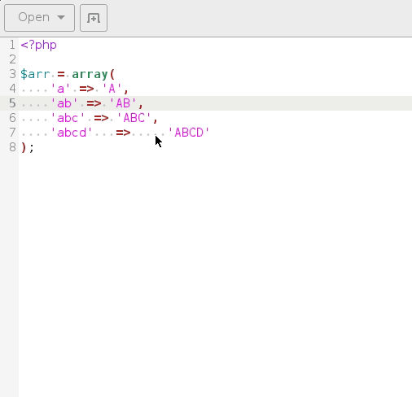

# Gedit 3 Align Plugin

## How to compile

just type `make`

## How to install

    sudo cp org.gnome.gedit.plugins.align.gschema.xml /usr/share/glib-2.0/schemas/
    sudo glib-compile-schemas /usr/share/glib-2.0/schemas/
    mkdir -p ~/.local/share/gedit/plugins/gedit-align
    cp align.plugin libalign.so ~/.local/share/gedit/plugins/gedit-align

## Thanks

https://github.com/placidrage/gedit-align
